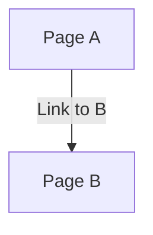

# sok

[KOS](https://mdzielinski.github.io/sok/kos)

## podrozdział sok

### Gist?
as script:

As md url:
[gist](https://gist.github.com/mdzielinski/5f7f608b7cab3ecee3e521d9efb8d3cf.js)

### Second, private gist:

And private repo:
- [private repo](https://github.com/mdzielinski/private)
- [private repo/](https://github.com/mdzielinski/private/)
- [private repo/file](https://github.com/mdzielinski/private/README)
- [private repo/file.ext](https://github.com/mdzielinski/private/README.md)
